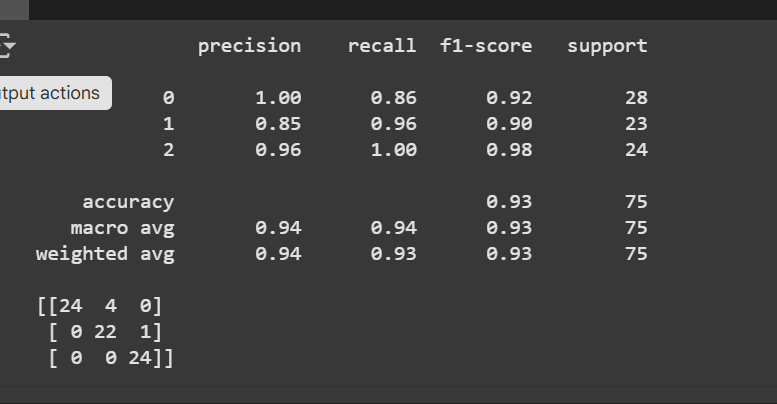

# 🧠 Stress Level Predictor using Machine Learning + Streamlit

This project is an AI-powered web application that predicts a person’s **stress level** (Low, Moderate, or High) based on simple health and lifestyle indicators. It also recommends a tailored YouTube video to improve the user’s mental state.

Built using:
- ✅ Random Forest Classifier (ML)
- ✅ Streamlit (for deployment)
- ✅ Real-world health dataset (374 samples)

---

## 📌 Why I Built This

As a Computer Science & AI student, I wanted to build a machine learning project that was:
- 🌍 Relevant to **real human well-being**
- 🔍 Grounded in **interpretable features**
- 📱 Easy to interact with — **like a product**

Mental health is deeply tied to lifestyle. This project analyzes patterns in **sleep, activity, and biological signals** to help people understand their stress risk — and then provides helpful video content, not just a label.

---

## 🔢 Dataset Used

- Source: [Kaggle](https://www.kaggle.com/datasets/uom190346a/sleep-health-and-lifestyle-dataset)
- Rows: 374 samples
- Features: Gender, Age, Sleep Duration, Quality of Sleep, Physical Activity, Stress Level, Heart Rate, BMI Category, etc.
- Target: `Stress Level` (numerical values from 3 to 8)

I cleaned and binned these into:
- `0`: Low
- `1`: Moderate
- `2`: High

---

## 🔍 Feature Selection – Why These Inputs?

After deep EDA (Exploratory Data Analysis), I selected **5 features**:

| Feature | Why I Chose It |
|---------|----------------|
| `Gender` | To analyze if stress differs across gender lines (helps learn patterns) |
| `Sleep Duration` | Key lifestyle factor directly tied to recovery and mental stability |
| `Quality of Sleep` | More indicative than duration alone — poor quality leads to cognitive fatigue |
| `Heart Rate` | Biological stress indicator — elevated HR correlates with stress |
| `BMI Category` | Reflects long-term health risks, sometimes correlated with lifestyle-related stress |

✅ I dropped `Occupation`, `Daily Steps`, and `Physical Activity` due to:
- Poor correlation with stress in visual plots
- Redundancy
- Weak contribution to model performance

---

## 📊 Observations During EDA

- People with **poor sleep quality** (rated <5) tended to have **moderate to high stress levels**
- High **heart rate ** was common in high-stress predictions
- Most people with **Normal BMI** and **good sleep (>7h)** were in the low-stress zone
- **Occupation** did not contribute meaningful classification — stress was visible across all job roles

> These findings were backed by visualizations like boxplots, countplots, and correlation checks.

---

## 🧠 Model Used

- ✅ Random Forest Classifier
- Achieved **~93% accuracy** on test data
- Strong on precision, recall, and balanced F1 score

```python
Classification Report:
Precision: 93% | Recall: 93% | F1 Score: 93%

> ℹ️ This is a working v1 version. 
